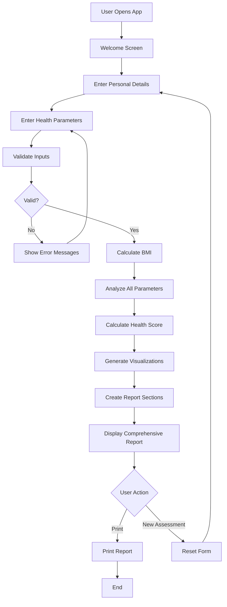
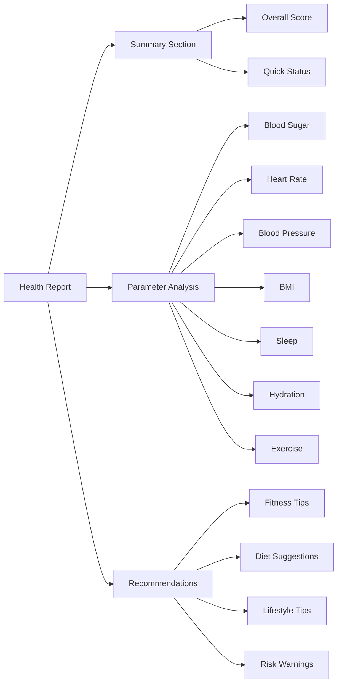

# Healthcare and Fitness Tracking Application - Implementation Plan

## Project Overview
A user-friendly, beautiful HTML-based health tracking application that collects health parameters and generates comprehensive reports with fitness and diet recommendations.

## Application Features

### 1. User Input Section
- **Personal Information**
  - Name
  - Age (for personalized health ranges)
  - Gender (Male/Female/Other - affects health parameter ranges)
  
- **Health Parameters**
  - Blood Sugar (mg/dL) - Fasting
  - Heart Rate (bpm)
  - Blood Pressure - Systolic/Diastolic (mmHg)
  - Weight (kg)
  - Height (cm) - for BMI calculation
  - Sleep Hours (per night)
  - Water Intake (liters per day)
  - Exercise Duration (minutes per day)

### 2. Report Generation Features

#### Overall Health Score
- Calculated based on all parameters
- Score range: 0-100
- Color-coded: Green (Excellent), Yellow (Good), Orange (Fair), Red (Poor)

#### Individual Parameter Analysis
Each parameter will show:
- Current value
- Status indicator (Optimal/Normal/Warning/Critical)
- Gauge chart visualization
- Comparison with healthy range
- Specific recommendations

#### Comprehensive Report Sections
1. **Health Summary Dashboard**
   - Overall health score with visual indicator
   - Quick status overview of all parameters

2. **Detailed Parameter Analysis**
   - Blood Sugar Analysis (Normal: 70-100 mg/dL fasting)
   - Heart Rate Analysis (Normal: 60-100 bpm, varies by age)
   - Blood Pressure Analysis (Normal: <120/80 mmHg)
   - BMI Analysis (calculated from weight/height)
   - Sleep Quality Analysis (Recommended: 7-9 hours)
   - Hydration Level Analysis (Recommended: 2-3 liters)
   - Physical Activity Analysis (Recommended: 30+ minutes)

3. **Fitness Recommendations**
   - Cardio exercises based on heart rate and BP
   - Strength training suggestions
   - Flexibility exercises
   - Activity level recommendations

4. **Diet Suggestions**
   - Based on blood sugar levels
   - Based on BMI and weight goals
   - Hydration tips
   - Meal timing recommendations

5. **Lifestyle Tips**
   - Sleep hygiene recommendations
   - Stress management techniques
   - Daily routine suggestions
   - Preventive health measures

6. **Risk Warnings**
   - Critical parameter alerts
   - Health risk indicators
   - When to consult a doctor

### 3. Visual Design Elements

#### Color Scheme (Colorful & Friendly)
- Primary: Vibrant blue (#4A90E2)
- Success: Fresh green (#7ED321)
- Warning: Warm orange (#F5A623)
- Danger: Soft red (#E74C3C)
- Background: Light gradient (white to light blue)
- Accent colors for different health metrics

#### Chart Types
- **Gauge Charts**: For current status of each parameter
  - Semi-circular gauges with color zones
  - Needle pointing to current value
  
- **Bar Charts**: For comparison with healthy ranges
  - Horizontal bars showing current vs. optimal
  - Color-coded sections

#### Layout Structure
- Responsive design (mobile-friendly)
- Card-based layout for each section
- Smooth animations and transitions
- Icons for each health parameter
- Print-friendly styling

## Technical Implementation

### File Structure
```
health-fitness-tracker/
├── index.html          (Main application file)
├── styles.css          (All styling)
├── script.js           (Application logic)
├── README.md           (Usage instructions)
```

### Technology Stack
- **HTML5**: Semantic structure
- **CSS3**: Modern styling with flexbox/grid, animations, gradients
- **Vanilla JavaScript**: No external dependencies
- **Canvas API**: For gauge and bar chart visualizations (lightweight, no libraries needed)
- **Print CSS**: For report printing

### Key JavaScript Functions

#### Data Collection & Validation
1. `collectUserData()` - Gather form inputs
2. `validateInputs()` - Validate health parameters
3. `calculateBMI(weight, height)` - Calculate BMI from weight/height

#### Analysis Functions
4. `analyzeBloodSugar(value, age)` - Analyze blood sugar levels
5. `analyzeHeartRate(value, age, gender)` - Analyze heart rate
6. `analyzeBloodPressure(systolic, diastolic, age)` - Analyze BP
7. `analyzeBMI(bmi, age, gender)` - Analyze BMI
8. `analyzeSleep(hours)` - Analyze sleep quality
9. `analyzeHydration(liters, weight)` - Analyze water intake
10. `analyzeExercise(minutes, age)` - Analyze physical activity

#### Scoring & Report Generation
11. `calculateHealthScore(allParameters)` - Overall health score algorithm
12. `generateReport()` - Compile comprehensive report
13. `checkRiskWarnings(parameters)` - Identify critical parameters

#### Recommendations
14. `getFitnessRecommendations(parameters)` - Generate fitness tips
15. `getDietSuggestions(parameters)` - Generate diet advice
16. `getLifestyleTips(parameters)` - Generate lifestyle recommendations

#### Visualization
17. `drawGaugeChart(canvasId, value, min, max, zones)` - Create gauge visualizations
18. `drawBarChart(canvasId, current, optimal, label)` - Create comparison charts

#### Utilities
19. `printReport()` - Print/save functionality
20. `resetForm()` - Clear form and start over

### Health Parameter Ranges (Age/Gender Adjusted)

#### Blood Sugar (Fasting)
- Optimal: 70-100 mg/dL
- Pre-diabetic: 100-125 mg/dL
- Diabetic: >125 mg/dL

#### Heart Rate (varies by age)
- Adults (18-65): 60-100 bpm
- Athletes: 40-60 bpm
- Elderly (65+): 60-100 bpm

#### Blood Pressure
- Optimal: <120/80 mmHg
- Elevated: 120-129/<80 mmHg
- High (Stage 1): 130-139/80-89 mmHg
- High (Stage 2): ≥140/90 mmHg

#### BMI (Body Mass Index)
- Underweight: <18.5
- Normal: 18.5-24.9
- Overweight: 25-29.9
- Obese: ≥30

#### Sleep Hours
- Optimal: 7-9 hours
- Minimum acceptable: 6 hours
- Excessive: >10 hours

#### Water Intake
- Minimum: 2 liters/day
- Optimal: 2.5-3.5 liters/day (varies by weight and activity)

#### Exercise Duration
- Minimum: 30 minutes/day
- Optimal: 45-60 minutes/day
- Excellent: >60 minutes/day

## Application Flow



## Report Structure



## Implementation Steps

### Phase 1: Structure & Design
1. Create project directory
2. Build HTML structure with semantic sections
3. Design CSS with colorful, friendly theme
4. Implement responsive layout

### Phase 2: Input Forms
5. Create personal details form
6. Create health parameters form
7. Add form validation
8. Implement data collection

### Phase 3: Analysis Engine
9. Implement parameter analysis logic
10. Create health score algorithm
11. Build recommendation engine
12. Implement risk warning system

### Phase 4: Visualizations
13. Create gauge chart renderer
14. Create bar chart renderer
15. Implement color-coded indicators

### Phase 5: Report Generation
16. Build report compilation system
17. Create all report sections
18. Implement print functionality

### Phase 6: Testing & Documentation
19. Test with various inputs
20. Create user documentation

## Key Design Principles

1. **User-Friendly**: Simple, intuitive interface
2. **Beautiful**: Colorful, modern design with smooth animations
3. **Informative**: Clear explanations and actionable recommendations
4. **Accessible**: Works on all devices, easy to read
5. **Self-Contained**: Single HTML file with embedded CSS/JS (optional separate files)
6. **No Dependencies**: Pure HTML/CSS/JavaScript, no external libraries required

## Success Criteria

- ✅ Clean, colorful, and friendly user interface
- ✅ Comprehensive health parameter input
- ✅ Accurate analysis with age/gender consideration
- ✅ Visual gauge and bar charts
- ✅ Detailed report with all sections
- ✅ Personalized recommendations
- ✅ Risk warnings for critical values
- ✅ Print/save functionality
- ✅ Responsive design
- ✅ No external dependencies

## Next Steps

Once you approve this plan, I will switch to Code mode to implement the application following this detailed specification.
